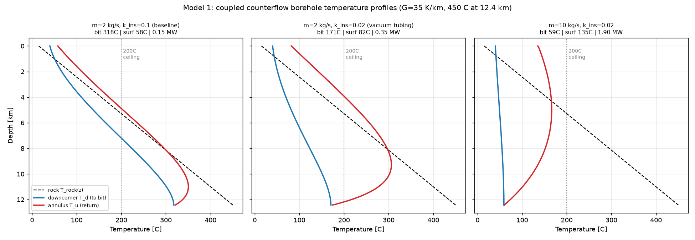
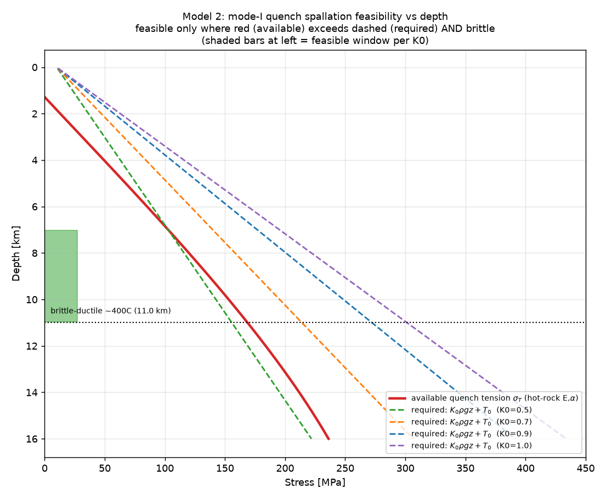
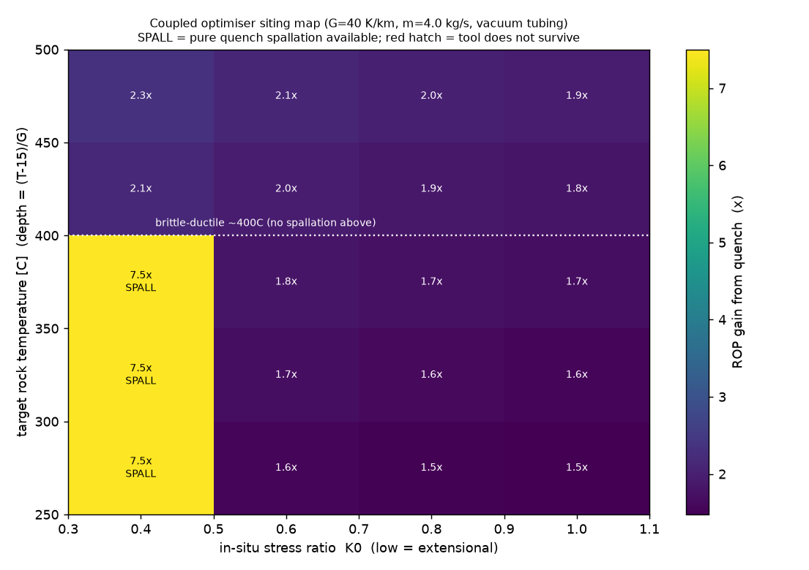
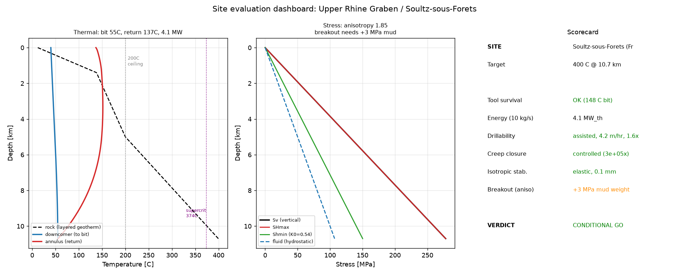
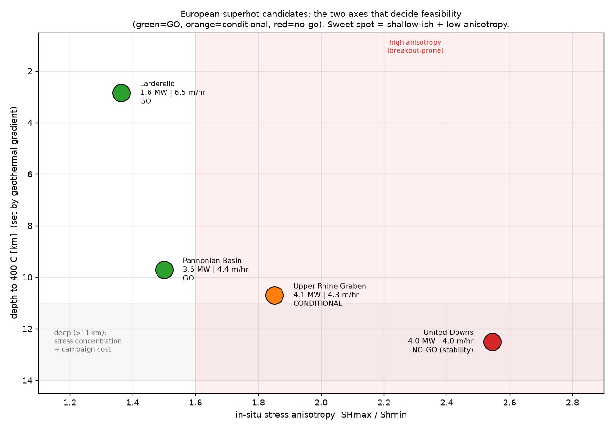

# Deep and superhot-rock geothermal: a first-principles model stack and site-evaluation tool

A self-contained set of coupled physical models, in Python, for the engineering questions that decide whether deep and superhot-rock geothermal wells can be drilled, kept survivable for the tools, kept open, and made to pay back in energy. Alongside them is a tool that scores a real candidate site against all of it.

The models are built from first principles with real material data: IAPWS-95 water properties, with rock and in-situ-stress parameters from the literature. Every constant is sourced and exposed as a knob, and every model states its own assumptions and limits. The aim was a defensible analysis that has been pressure-tested, including results that constrain or weaken the starting idea.

> Status and honesty note. These are order-of-magnitude models: 1-D or axisymmetric, mostly quasi-steady, with several coupling parameters that are uncertain and flagged as such. Their job is to locate the binding constraints and put numbers on the trade-offs. They do not replace a full reservoir or geomechanical simulator. The limitations are listed per model and again at the end.

---

## The questions, and what the models found

| # | Model | Question | Headline result |
|---|-------|----------|-----------------|
| 1 | `model1_coupled.py` | Can a circulating coolant loop keep the bottom-hole assembly survivable while exporting heat at 10-20 km? | Yes, within a flow and insulation window. A single closed loop is conduction-limited at around 3-4 MW. Water stays dense and supercritical, with no flashing, below about 2 km. |
| 2 | `model2_spallation.py` | Can a cold-coolant quench fracture hot rock at the cutting face? | Tensile spallation is confinement-limited. It works only in low-K0 (extensional) crust below the brittle-ductile transition. Elsewhere the quench lowers the effective cutting energy instead of breaking the rock outright. |
| 3 | `model3_optimiser.py` | Couple drilling and thermal balance: where does the integrated loop win? | Quench raises the rate of penetration by 1.5 to 2.3 times in the assisted regime, and up to 7.5 times in a narrow spallation window. Output is a siting and operating map. |
| 4 | `model4_hole_stability.py` | Does cooling the hot ductile rock keep the hole open? | Cooling slows time-dependent creep closure by a factor of 10^5 to 10^6. Convective heat resupply to the cooled zone is negligible, with a Péclet number well below 1. |
| 5 | `model5_convergence_confinement.py` | Is breakout at depth a collapse or a manageable yielded zone? | Breakout produces a millimetre-scale yielded zone held by fluid pressure, well short of collapse. Cooling adds 3 to 6 km of stable depth. The limit is stress anisotropy (SHmax/Shmin); temperature matters less. |

### Model figures



Model 1, G = 35 K/km with 450 °C at 12.4 km. Baseline insulation leaves the bit at 318 °C. Vacuum tubing brings it to 171 °C. Raising flow to 10 kg/s brings it to 59 °C and the export to 1.90 MW.



Model 2, available quench tension against the tension required at each confining ratio K0. Spallation needs the red curve above the dashed line and the rock still brittle, which is the shaded window at low K0.



Model 3, ROP gain from quench across target temperature and stress ratio. The 7.5x band is pure spallation, at K0 below 0.5 and below the brittle-ductile transition. Everywhere else the gain runs 1.5 to 2.3x.

### Integrating tool
- `site_evaluation.py` runs Models 1 to 5 against a real `SiteProfile`, meaning the site's geothermal gradient and stress state plus its rock data, and returns a verdict with the operating envelope.
- `comparative_sites.py` scores four European provinces side by side.



`site_evaluation.py` output for Soultz-sous-Forêts: thermal profile, stress state and scorecard. Target 400 °C at 10.7 km, tool survival OK at 148 °C, 4.1 MW_th, breakout needs +3 MPa of mud weight. Verdict CONDITIONAL GO.

### Comparative result (European superhot candidates, target 400 °C)

| Site | Depth to 400 °C | SHmax/Shmin | Verdict | Why |
|------|-----------------|-------------|---------|-----|
| Pannonian Basin (HU) | 9.7 km | 1.50 | GO | high gradient brings superhot shallower; moderate stress |
| Larderello (IT) | 2.9 km | 1.36 | GO | extreme gradient, very shallow, but lowest power |
| Upper Rhine Graben (FR) | 10.7 km | 1.85 | CONDITIONAL | marginal breakout, needs +3 MPa mud weight |
| United Downs (UK) | 12.5 km | 2.55 | NO-GO | strike-slip: breakout exceeds the fracture gradient |

The two governing axes fall out of the physics. Geothermal gradient sets the depth to superhot. Stress anisotropy sets stability.



---

## Key engineering conclusions

- Closed-loop power is limited by conduction and barely moves with diameter. Ten times the borehole diameter gives about 1.9 times the heat, a logarithmic gain, while cutting cost grows with the square of the radius. What matters instead is contact length through laterals, or the number of wells, or opening fracture area. (`model1_diameter_scaling.py`)
- Depth raises the grade of the heat more than the power, and it is capped by the brittle-ductile transition near 400 °C, which sits between 5.5 and 19 km depending on gradient. Active cooling takes tool survival off the table as the limit, and the rock does the limiting. (`model1_depth_limits.py`)
- The contribution is the integrated computational capability. The mechanism itself is prior art: cold-quench rock fracture appears in Holtzman et al. (GRC Transactions 47, 2023) and in the cryogenic and thermal-shock EGS stimulation literature. What is added here is a coupled model stack, with real material properties, that scores sites and reproduces known trade-offs.

---

## Running it

```bash
pip install -r requirements.txt
python water_table.py        # one-time: build the cached IAPWS-95 property table (~2.5 min)
python site_evaluation.py    # full verdict for the Upper Rhine Graben / Soultz site
python comparative_sites.py  # four-site comparison table
```

Each model file runs standalone and prints its own analysis (`python model1_coupled.py`, and so on). The figure scripts (`*_figures.py`) regenerate the PNGs.

### Layout
```
geo_constants.py          sourced constants (geotherm, rock, drilling, geometry)
water_props.py            IAPWS-95 wrapper (point queries)
water_table.py            cached, vectorised IAPWS-95 property table (T,P grid)
model1_coupled.py         coupled 1-D counterflow borehole heat exchanger (BVP)
model1_steadystate.py     single-depth bottom-hole heat balance
model1_diameter_scaling.py / model1_depth_limits.py   scaling analyses
model2_spallation.py      thermoelastic quench fracture vs confining stress
model3_optimiser.py       coupled drilling and thermal optimiser, siting map
model4_hole_stability.py  creep closure and convection (Péclet) check
model5_convergence_confinement.py   ground-reaction-curve hole stability
site_evaluation.py        SiteProfile and integrated verdict
comparative_sites.py      four European provinces
*_figures.py              figure generators
```

---

## Limitations (read before trusting any number)

- Dimensionality. Model 1 is 1-D. Models 2 and 5 are axisymmetric or plane-strain. Stress anisotropy enters the breakout check through SHmax and Shmin, but 3-D geometry is otherwise simplified.
- Time dependence. The rock-coupling and stability models are mostly quasi-steady. Multi-year reservoir thermal decline, which drives the production economics, is left out on purpose, since the drilling face meets fresh rock.
- Uncertain coupling. The quench-to-effective-MSE parameters (`chi_macro`, `chi_micro`) and the high-temperature rock flow law come from the literature and need experimental calibration. Results are reported as sensitivities.
- Stress data. Deep in-situ stress, above all the anisotropy below measured depths, is the largest input uncertainty in the site verdicts.
- Intact rock. Faulted or altered rock will behave worse than the intact-strength values used here.

